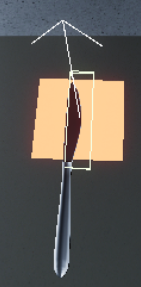
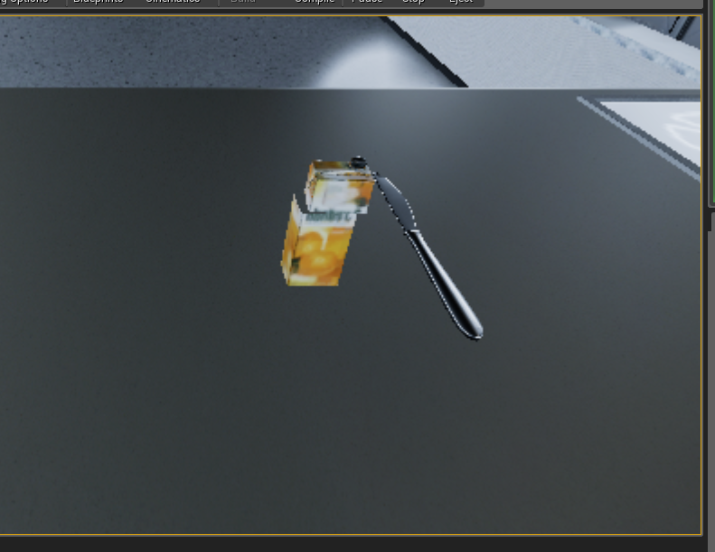

# Milestone 1 - deadline 31.12.17

* Cutting core code
  * Basic cutting (not all specifics are handled)
* GUI-Prototype
  * Being able to edit the knife
* Debug visuals
  * slicing plane can be visualized
  * cutting area can be visualized
  * cutting trajectory can be visualized
  
## Features
These are all currently implemented Features you're able to use in projects.

- The ability to cut through chosen StaticMeshComponents
	- Chosing certain StaticMeshComponents in the Editor giving a tag
- Have chosen Knifes able to cut certain StaticMeshComponents and generate ProceduralMeshComponents
	- By using Tags to identify them
	- Placing Sockets as the Positions SlicingLogicBoxes
		- Which updates all already placed and coming StaticMeshComponents with the chosen StaticMesh with these Sockets.
- Toggleable Debug Functions able to:
	- Print out text as needed (Basic in it, but only throwing "Test" right now)
	- Draw a DebugPlane showing a Plane on which the Component will be cut.
	- Draw Debugboxes, showing the position of the LogicBoxes on the Knife.
	- Draw the Trajectory of the Knife, up to 1 second ago currently.
- Editor Buttons on which the Debug Functions are Toggleable and Sockets of StaticMeshComponent can be filled with the Boxes.
	- Toggleable Debug Checkboxes
	- Button to spawn LogicBoxes on chosen StaticMeshComponents.

# Documentation

* The project is realized with a plugin. This plugin is then split up into two different modules: one for extending the Unreal Editor and one that deals with the actual logic of the slicing/cutting, called SlicingEditorModule and SlicingLogicModule respectively.

### SlicingEditorModule:

* In the Unreal Editor there are now two new toolbar buttons that appear if the Slicing plugin is loaded in the project.
  * One is seen in the Static Mesh Editor that gets opened if one selects any already existing static mesh and edits it (with the title "Show Slicing Instructions"). This button is only used as a tutorial for the user, so that he knows what he should be doing for the cutting to be working. The user would need to create new sockets in this editor, which would then be converted in the next toolbar button.
    * 
  * The other toolbar button is seen in the Level Editor that one sees when the Unreal Editor starts up (with the title "Slicing Options"). It has a drop-down menu in which it's possible to change the debug-options to be enabled/disabled. Another important button in the drop-down menu is the conversion of the sockets that were previously created. This is needed to actually change object in the world, compared to just the templates (aka the static meshes).
    * 
  * A good start to find out how to extend the Unreal Editor is found here: https://www.youtube.com/watch?v=zg_VstBxDi8
* There are 4 classes that were created:
  * FSlicingEditorModule
    * This is the core class for the module. It not only represents the module itself but is the main point from where all the other classes are loaded/accessed from.
    * In here the UI elements get initialized by using the FSlicingEditorCommands class, which then get mapped to functions of the FSlicingEditorActionCallbacks class.
    * Those buttons then get added to the Unreal Editor by using the extension points that are exposed by the Unreal Editor, through the usage of FExtender and MenuBuilder.
  * FSlicingEditorStyle
    * This class is only needed to define the aesthetic of the UI elements. This is a standard class that is generated with every plugin by the Unreal Editor. In our case it's mainly used to display the icons of the two UI elements, but can be extended if one needs more customization on the look of the buttons (or other future elements).
  * FSlicingEditorCommands
    * This class is only used to register the commands of the UI elements that need to be added. This means the UI buttons that are used in the plugin are defined and initialized with the help of this class.
    * Here one defines what kind of UI element a given element should be (in our case either a togglebutton for the debug options, or a button for the rest of the elements), the texts that are  associated with the element (e.g. hover-over text) and an optional hotkey-association.
  * FSlicingEditorActionCallbacks
    * This is a class purely with static functions that are associated with the selection of a specific UI element. Therefore they are only called once the user presses the button associated with the function (the mapping of the function happens in the module-class).

### SlicingLogicModule:

* The new buttons loaded, coming from from the Slicing Plugin, are now having a logic and functionality adding:
	* The functionality and logic to work with the booleans from the EditorModule, like toggleable Debug Draws  
		*   
	* Another is the functionality to cut objects with the spawned Component.  
		* 
* There are 2 classes that were created:
	* USlicingComponent
		* This is the component which can be spawned and inherits from the UBoxComponent class.
		* It holds the logic to ...
			* convert StaticMeshComponent to ProceduralMeshComponent.
			* cut a ProceduralMeshComponent in two pieces along a given plane.
			* tick and draw different Debug functions like a Box depending on the situation.
		* It uses the Booleans of the Checkboxes in the Editor for Debugging.
	* FSlicingLogicModule 
		* This class is a small one holding the changable variables.
		* It's only use currently is to use these variables by including it.

### SlicingComponent:
  
# Tutorial

## Creating a new Knife

### Step 1: Creating Sockets in the StaticMeshEditor

For this first choose a StaticMesh on which you want the SlicingLogic to be.
In this example we use the **SM_Knife_Table**. Double click on it in the
**Content Browser** to open the StaticMeshEditor for it.

In the top bottom should be a tab called **Socket Manager**. Press the button
and add three sockets named **BladeBox**, **Handle** and **CuttingExitpointBox**.
It should look like this: 

From there on you can begin to place the tokens as needed in the StaticMeshEditor, e.g.

***Note:*** **Currently you can only give the sockets relative scales value from 0 to 1.**

With that done you can save the StaticMesh in the StaticMeshEditor and leave it.
All the StaticMeshComponents with that StaticMesh now all have these Sockets.

### Step 2: Tag a StaticMeshComponent to a Knife

Since we don't want all **SM_Knife_Table** to be Cuttable we give the the Components, who
are supposed to be, a Tag names ***Knife***.

For this click on your desired Knife in the Viewport and click on the StaticMeshComponent
in the Details Tab on the right.

Then scroll down towards the section called Tags. Click on 
and name the new Tag ***Knife***.

### Step 3: Spawn the boxes in the Editor

Now that the knife has it's Tag, we can begin to spawn the LogicBoxes.
First we select the StaticMeshComponent in the Editor followed by the
StaticMeshComponent in the Detail View.

Then on the top, in the same row as **Play** and **Launch**, there's the button
called "**Slicing Options**", clicking on it reveals more options such as Debug
Checkboxes. The important Button is "**Replace Sockets on Selected Object**".

After clicking it, it spawns the BoxComponents. If they don't appear at first
simply click on something else and click on the knife again. It just needs
to refresh.

***The Knife is done. Result:***

## Make Object Cuttable

### Step 1: Select StaticMeshComponent

To make an object cuttable select one in the Viewport.

### Step 2: Enable Overlap Boolean & Tag

Just as in ***Step 2: Tag a StaticMeshComponent to a Knife*** we now add a
tag called "**Cuttable**" into the Tag section. Refer to the mentioned Step
above on how to do that.

The other thing to do is activating that our Selected Mesh is able to generate
Ovelaps on it's own. For that simply go to the Collision section of your Selected
StaticMeshComponent click on ***Generate Overlap Event***.

***Now that object is Cuttable.***

### UI elements:

* In the final version, there are only two toolbar-buttons that are added by our plugin. One Button in the StaticMeshEditor and one in the LevelEditor.
  * To test the button in the StaticMeshEditor toolbar, the user has to select a StaticMesh in the "Content Browser", right-click it and select "Edit" in the context-menu. After this, the user will see the StaticMeshEditor and will see a new Button with the title "Show Slicing Instructions" in the toolbar. Clicking on it will open up the Pop-up window with the instructions.
  * Because the user would always start in the LevelEditor if he opens the Unreal Editor, the user only has to press the toolbar button "Slicing Options" to see the button in the LevelEditor toolbar. If one clicks on any of the debug-options, the boxes next to the options get selected/deselected. The socket conversion button was already tested/used in the previous tutorial.

### Testing the debug options:

* ...

	
# Todos

- Realistic Interactions and Physics of the Knife
- Button to fill all Sockets of StaticMeshComponents, who fall under the Knife Category, with LogicBoxes
- Split DebugPlan and DebugPlane Button to two.

# Issues

- The Boxes spawned are not saved on the .umap
- Sockets are not the same size as BoxComponents, causing some placement issues for now. (Limiting scale of the socket from 0 to 1)