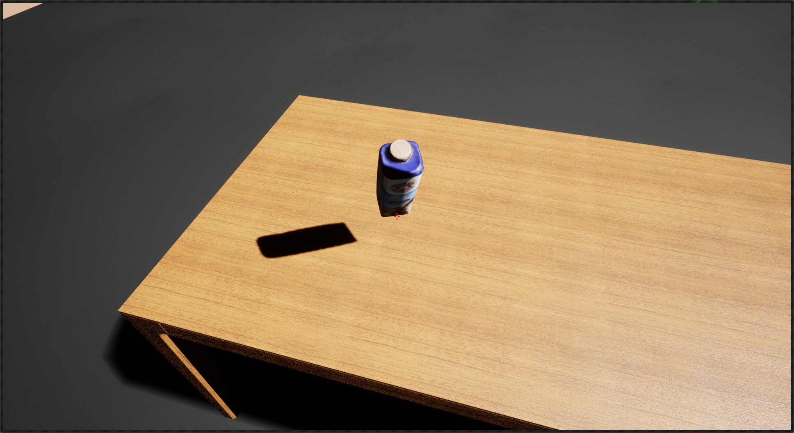

# Milestone 2 - deadline 30.03.18

* Pickup and object rotation with a menu.

# Documentation

* Bug Note: Objects can't be dropped at the moment and if the object was not rotated it won't be picked up in one of the hands. Because of the changes made the roation is not working correctly and needs some adjustments, so that a 360° rotaion is possible.

* The first part of the milestones was to create a seperate plugin. This plugin only depends on UTags and unnecessary functions are removed.

* For this milestone the HUD was reworked, it works now with code instead of blueprints. There are now two menus, one for the the question if the object should be rotated and one for the pick up in the left or right hand. 

* The testing of the functionalitys was done in a simple debug map and only with one object.

* The for the menus is created via a AHUD class, which manages the drawing of the menus and the corsshair. The following part of the code shows the drawing functions:

```
void AGameHUD::DrawHUD()
{
	if (CrosshairTexture)
	{
		// Find the center of our canvas.
		FVector2D Center(Canvas->ClipX * 0.5f, Canvas->ClipY * 0.5f);

		// Offset by half of the texture's dimensions so that the center of the texture aligns with the center of the Canvas.
		FVector2D CrossHairDrawPosition(Center.X - (CrosshairTexture->GetSurfaceWidth() * 0.5f), Center.Y - (CrosshairTexture->GetSurfaceHeight() * 0.5f));

		// Draw the crosshair at the centerpoint.
		FCanvasTileItem TileItem(CrossHairDrawPosition, CrosshairTexture->Resource, FLinearColor::White);

		TileItem.BlendMode = SE_BLEND_Translucent;

		Canvas->DrawItem(TileItem);
	}
}

void AGameHUD::DrawMenu()
{
	SAssignNew(GameUI, SGameUI).GameHUD(this);

	if (GEngine->IsValidLowLevel())
	{
		GEngine->GameViewport->AddViewportWidgetContent(SNew(SWeakWidget).PossiblyNullContent(GameUI.ToSharedRef()));
	}
}

void AGameHUD::RemoveMenu()
{
	GEngine->GameViewport->RemoveAllViewportWidgets();
}

void AGameHUD::DrawPickUpMenu()
{
	SAssignNew(PickupGameUI, SPickupGameUI).GameHUD(this);

	if (GEngine->IsValidLowLevel())
	{
		GEngine->GameViewport->AddViewportWidgetContent(SNew(SWeakWidget).PossiblyNullContent(PickupGameUI.ToSharedRef()));
	}
}
```

The crosshair is drawn when the object is created as a static class and the other menus will be drawn and removed when the functions for them are called. It is a stange way to draw them because two instances of the object are created bur for now it is the only found solution.

```
AUGameModeBase::AUGameModeBase()
{
	HUDClass = AGameHUD::StaticClass();
	PickupHUD = CreateDefaultSubobject<AGameHUD>(TEXT("PickupHUD"));
}

void AUGameModeBase::DrawHudMenu()
{
	PickupHUD->DrawMenu();
}

void AUGameModeBase::RemoveMenu()
{
	PickupHUD->RemoveMenu();
}

void AUGameModeBase::DrawPickupHudMenu()
{
	PickupHUD->DrawPickUpMenu();
}
```

The actual code for the menus is taken from the following link (Slate Tutorial) [https://wiki.unrealengine.com/Template:Slate_Introduction_%E2%80%92_Basic_Menu_Part_1] and can be found in the classes "GameUI" and "PickupGameUI".
This tutorial will also be used to later adjust the menu "buttons".

* To enable the pick up and rotation with a menu the "GPickup" and "GameController" classes were adjusted. It should be noted that at there is alot of unnecessary code at the moment, which will be removed at a lter point. 
For the menu pick up the character has to stand still, which is solved with a boolean which shows if a menu is active.

```
// Stop movment when menu is active by Wlademar Zeitler
	if (PickupComponent->bPickUpStarted && !bIsMovementLocked)
	{
		SetPlayerMovable(false);
	}
	else if (!PickupComponent->bPickUpStarted &&  bIsMovementLocked)
	{
		SetPlayerMovable(true);
	}

// Rotate the object depending of the rotation mode by Waldemar Zeitler
	if (PickupComponent->bRotationStarted) { 
...
```

Most of the functionality is done in the "GPickup" "TickComponent" were the class asks if a button was pressed.

```
// Handle the menu for the pickup and the rotation (Milestone 2)
	if (bLockedByOtherComponent == false && bAllCanceled == false) {
		ItemToHandle = PlayerCharacter->FocussedActor;

		// Pick is initiated and first it will be asked for rotation
		if (bRightMouseHold && !bRotationMenuActivated && !bPickupnMenuActivated) {
			bRotationMenuActivated = true;
			UGameMode->DrawHudMenu();
			bPickUpStarted = true;
		}
		// Player choose to rotate the object first
		else if (bLeftMouseHold && bRotationMenuActivated)
		{
			bRotationStarted = true;
			UGameMode->RemoveMenu();
			bRotationMenuActivated = false;
			MoveToRotationPosition();
		}
		// Instead of rotation the player wants to directly pick the object up
		else if (bRightMouseHold && bRotationMenuActivated && bButtonReleased)
		{
			bRotationStarted = false;
			bRotationMenuActivated = false;
			UGameMode->RemoveMenu();
			bPickupnMenuActivated = true;
			UGameMode->DrawPickupHudMenu();
			bButtonReleased = false;
		}

		// Pickup with either left or right hand
		if (bLeftMouseHold && bPickupnMenuActivated && !bRotationMenuActivated && bPickUpStarted)
		{
			bRotationStarted = false;
			UGameMode->RemoveMenu();
			PickUpItemAfterMenu(true);
			bPickUpStarted = false;
		}
		else if (bRightMouseHold && bPickupnMenuActivated && !bRotationMenuActivated && bPickUpStarted && bButtonReleased)
		{
			bRotationStarted = false;
			UGameMode->RemoveMenu();
			PickUpItemAfterMenu(false);
			bPickUpStarted = false;
			bButtonReleased = false;
		}
	}
```

This solution is at the moment a bit confusing and will be resolved at a later point.
The actual pick up is as it was before but adjusted to picking up for rotation and putting the object in the left or right hand afterwards. As mentioned above droping objects and picking them up without a rotation is not possible at the moment.

# Tutorial

* To pick an object up you have to look at it and push the right mouse button and afterwards the following menu will pop up.

Now you have the choice either pick the object up (does not work at the momemnt) or rotated it. If you choose to rotated the object it will be moved to the center of the screen (an actor is used as placeholder) and it is now possible to rotate it with the mouse movment (at the moment a bit buggy).  

When the you are finished with the rotation you can push the right mosue button again and menu for moving the object to the right or left hand will be called.  
   
The object can now be moved to the left or right hand with just pressing a mouse button.


