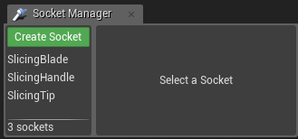
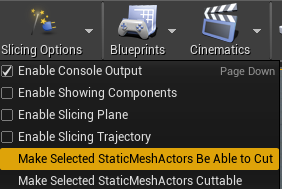
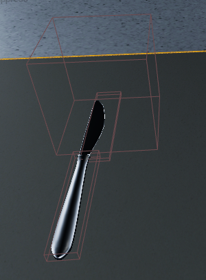
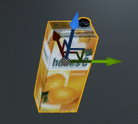
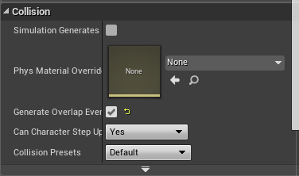

# UR17 - P2

## Creating a new Knife

### Step 1: Creating Sockets in the StaticMeshEditor

For this first choose a StaticMesh on which you want the SlicingLogic to be.
In this example we use the **SM_Knife_Table**. Double click on it in the
**Content Browser** to open the StaticMeshEditor for it.

In the top bottom should be a tab called **Socket Manager**. Press the button
and add three sockets named **BladeBox**, **Handle** and **CuttingExitpointBox**.
It should look like this: 

From there on you can begin to place the tokens as needed in the StaticMeshEditor, e.g.

With that done you can save the StaticMesh in the StaticMeshEditor and leave it.
All the StaticMeshComponents with that StaticMesh now all have these Sockets.

### Step 2: Spawn the boxes in the Editor

Now that the knife has the boxes, we can begin to spawn them inside the editor.
First we select the StaticMeshComponent in the Editor followed by the
StaticMeshComponent in the Detail View.

Then on the top, in the same row as **Play** and **Launch**, there's the button
called "**Slicing Options**", clicking on it reveals more options such as Debug
Checkboxes. The important Button is "**Replace Sockets on Selected Object**".

After clicking it, it spawns the BoxComponents. If they don't appear at first
simply click on something else and click on the knife again. It just needs
to refresh.

***The Knife is done. Result:***

## Make Object Cuttable

### Step 1: Select StaticMeshComponent

To make an object cuttable select one in the Viewport.

### Step 2: Enable Overlap Boolean & Tag

Just as in ***Step 2: Tag a StaticMeshComponent to a Knife*** we now add a
tag called "**Cuttable**" into the Tag section. Refer to the mentioned Step
above on how to do that.

The other thing to do is activating that our Selected Mesh is able to generate
Ovelaps on it's own. For that simply go to the Collision section of your Selected
StaticMeshComponent click on ***Generate Overlap Event***.

***Now that object is Cuttable.***